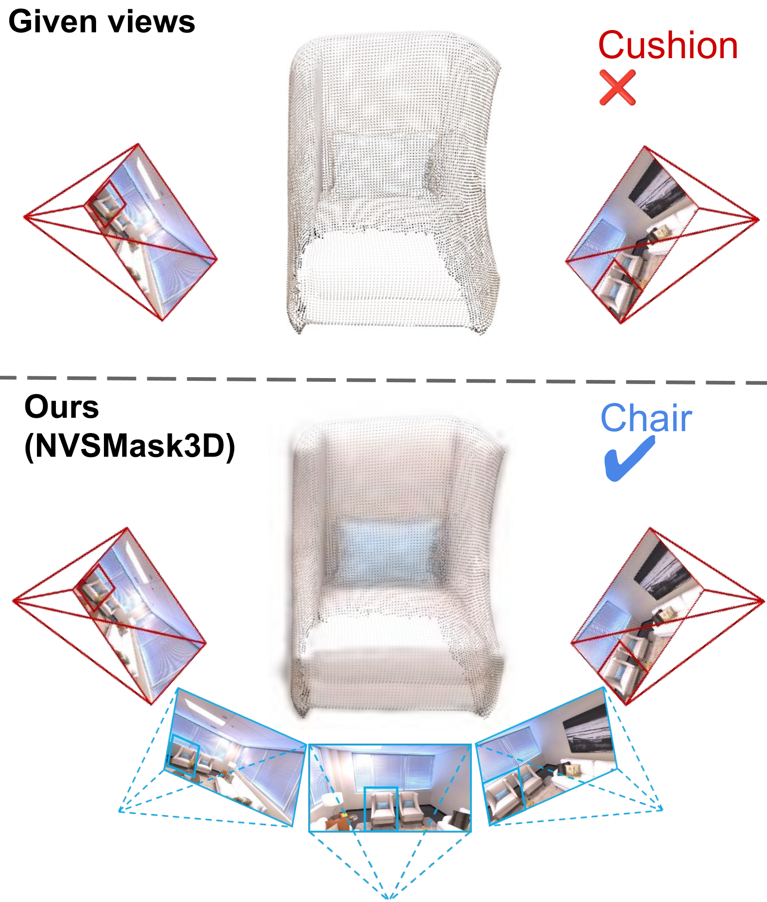

<div align="center">

# <strong>NVSMask3D</strong>: Hard Visual Prompting with Camera Pose Interpolation for 3D Open Vocabulary Instance Segmentation

<p align="center">
  <a href="https://github.com/junyuan-fang">Junyuan Fang</a> ·
  <a href="https://github.com/rzhevcherkasy">Zihan Wang</a> ·
  <a href="https://github.com/YejunZhang">Yejun Zhang</a> ·
  <a href="https://ffrivera0.github.io/">Shuzhe Wang</a> ·
  <a href="https://imelekhov.com/">Iaroslav Melekhov</a> ·
  <a href="https://users.aalto.fi/~kannalj1/">Juho Kannala</a>
</p>

<h2 align="center">SCIA 2025</h2>

<h3 align="center">
  <a href="https://arxiv.org/abs/2504.14638">Paper</a>
</h3>

</div>

---

This repository contains the public code for the SCIA 2025 paper  
**"NVSMask3D: Hard Visual Prompting with Camera Pose Interpolation for 3D Open Vocabulary Instance Segmentation."**

<div align="center">
  
</div>

Our method simulates realistic 3D perspectives through 3D Gaussian Splatting,  
effectively augmenting existing hard visual prompts by enforcing geometric consistency across viewpoints.

---

# Citation
If you find our work helpful, please consider citing:

```bibtex
@inproceedings{fang2025nvsmask3d,
  title={NVSMask3D: Hard Visual Prompting with Camera Pose Interpolation for 3D Open Vocabulary Instance Segmentation},
  author={Fang, Junyuan and Wang, Zihan and Zhang, Yejun and Wang, Shuzhe and Melekhov, Iaroslav and Kannala, Juho},
  booktitle={Scandinavian Conference on Image Analysis},
  pages={353--367},
  year={2025},
  organization={Springer}
}
```

⚠️ **Code status:** The codebase is currently being cleaned and organized and will be publicly released soon. Stay tuned!
